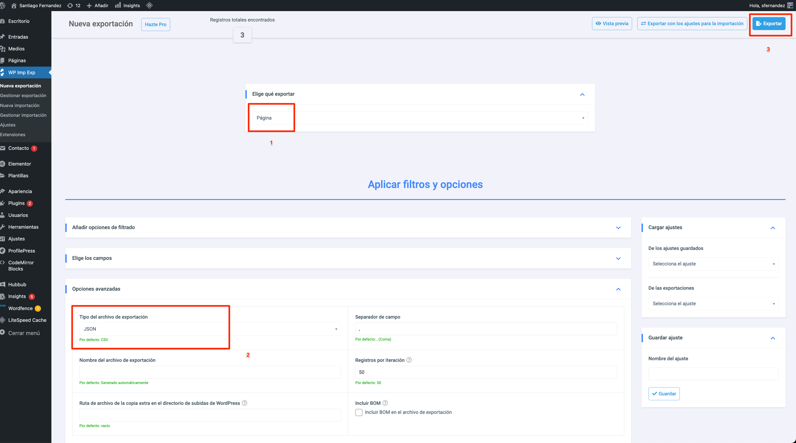
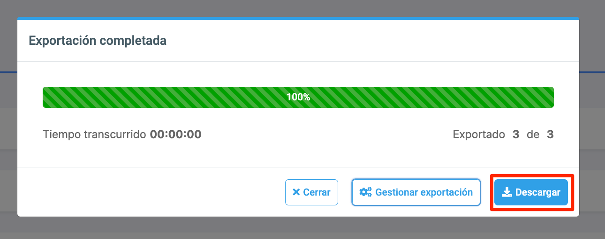
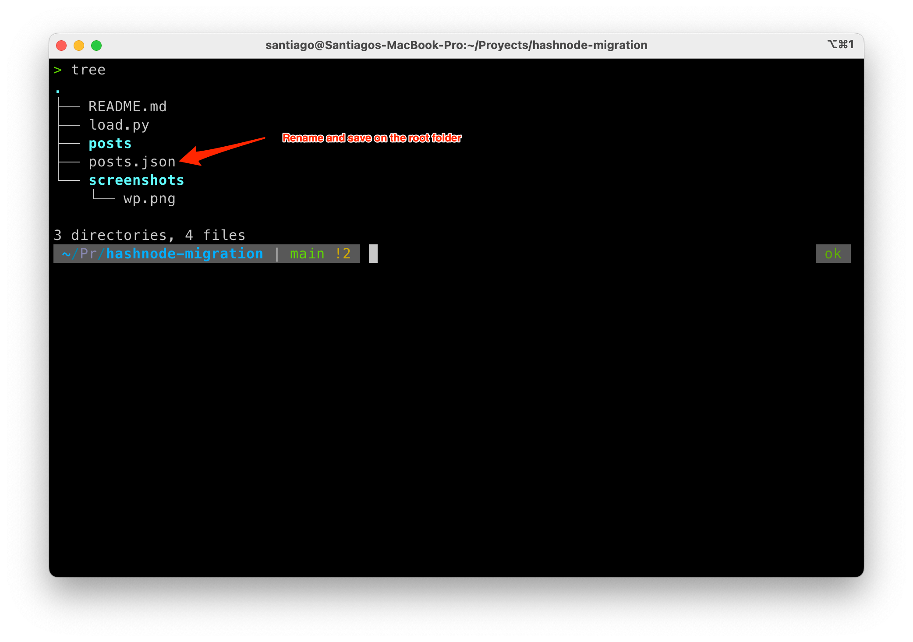
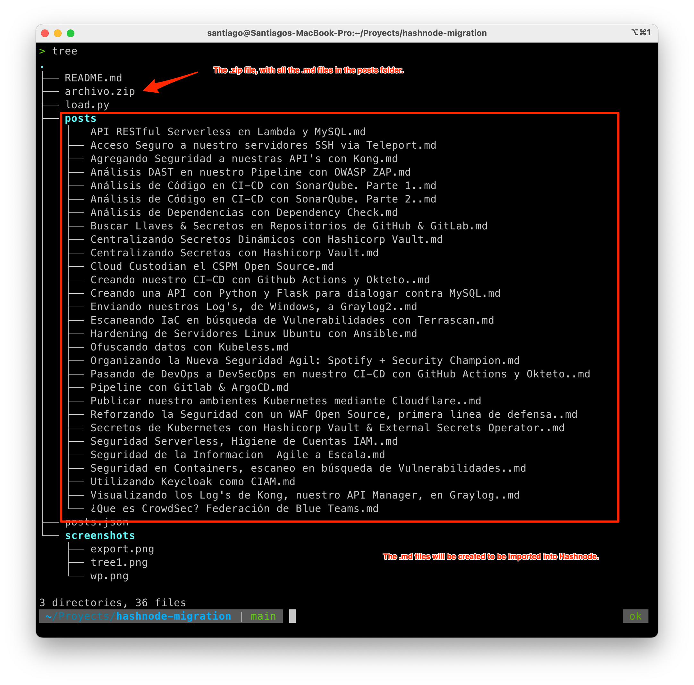
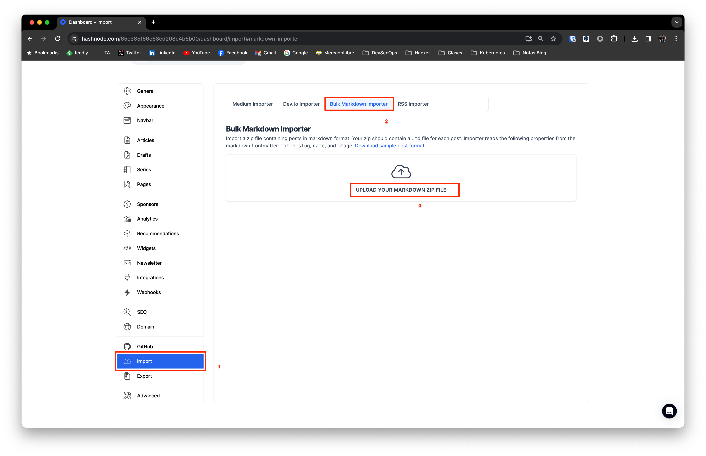
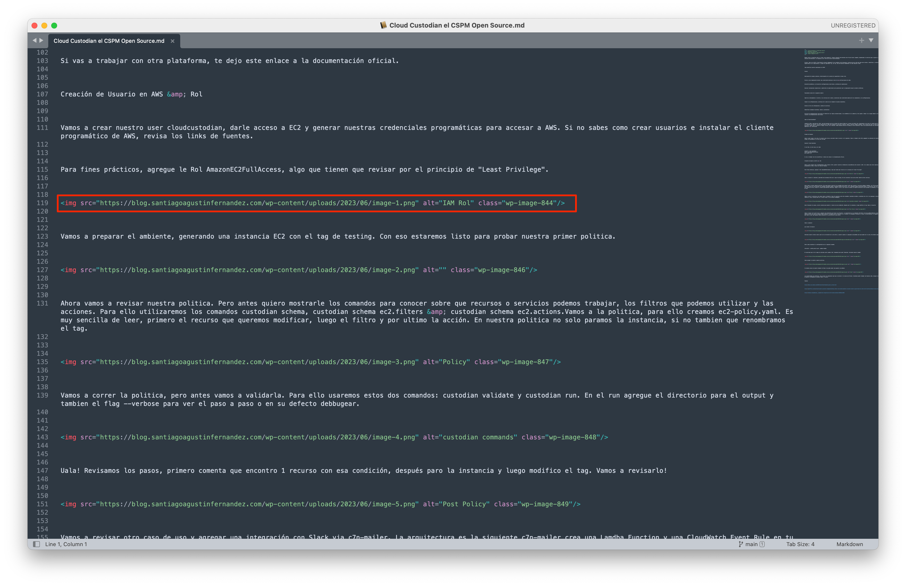

# Wordpress Migration to Hashnode

This involves the following steps.

We must export the posts, from Wordpress. To do this we will use the plugin [WP Import Export](https://wordpress.org/plugins/wp-import-export-lite/)



Export it



Please rename and save in the root folder of the cloned project.



Run the proyect with ```python3 load.py```



In the posts folder will be all the files to import in Hashnode, one by one, but we can use the .zip file that is in the root folder to upload all the posts at once. 

To import the .zip file, follow these steps.



If we check an .md, it is the post without the HTML tags and leave the image tags. This way you can edit the post and upload them from the Wordpress folder located in **wp-content/uploads**.



This is the easiest way to migrate from **Wordpress** to **Hashnode**. 

I leave this [reference to do it via API](https://kumar-ashwin-hubert.hashnode.dev/how-to-migrate-your-blog-from-wordpress-to-hashnode). As of today, it is not working. 